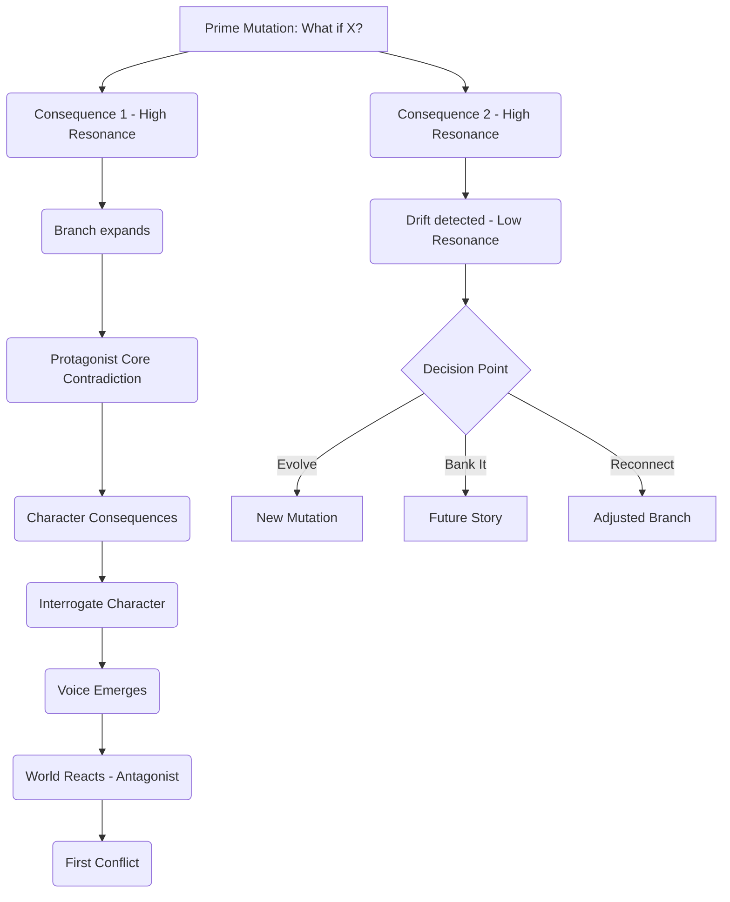

# 🌎 📘 World Engine Blueprint v3.3

### *The Recursive Interrogation Method — Reality Engineer Edition*
### *with Integrated Resonance Tracking & Character Consequence Cascade*

---

# 🧭 **How to Use This Blueprint (Quick Guide)**

This Blueprint is a **recursive interrogation engine** with a **north star**.

Use it like a **requirements-gathering interview** where:

- **You** = Reality Architect
- **The World/System** = Client
- **The Characters** = Witnesses who tell you who they are
- **Questions** = Diagnostic tools
- **Consequences** = Requirements (for both world AND characters)
- **Prime Mutation** = Your North Star (vision statement)
- **Resonance Tracking** = Compass keeping you on course
- **Contradictions** = Where characters emerge
- **World panic** = Where plot emerges

### 🔁 **The Creation Loop**

**FOR WORLDS:**
1. Pick a system ("Given X…")
2. Mutate one rule ("What if Y broke it?") ⭐ Your North Star
3. Generate consequences
4. Check resonance
5. Interrogate each consequence
6. Characters emerge naturally

**FOR CHARACTERS:**
1. Identify core contradiction
2. Generate consequences OF the contradiction ON the character
3. Interrogate the CHARACTER about each consequence
4. Write their answers in narrative/dialogue
5. Voice, personality, and depth emerge naturally

**You discover by asking questions.**

**Characters tell you who they are.**

**You never invent - you interrogate until they speak.**

---

# 🟥 **1. Base System Selection ("Given X…")**

**What existing system am I starting from?**

*(Don't justify — selection is enough.)*

**System:**

`______`

**Interrogatives (optional):**

- What assumption does this system take for granted?
- What part feels brittle?
- What blind spot does it hide?
- Who benefits?
- Who suffers?

---

# 🟧 **2. Prime Mutation ("…what if Y broke it?")**

⭐ **THIS IS YOUR NORTH STAR** ⭐

Everything you create should orbit around this mutation unless you consciously choose to evolve it.

**What-If Mutation:**

`______`

**Write it prominently. You'll refer back to this constantly.**

---

**Immediate Consequences (3–6):**

1.

2.

3.

4.

5.

---

# 🟠 **2.5 Prime Mutation - Your Vision Statement**

Before diving into branches, clarify your intent:

### **What story am I trying to tell?**

- Genre: `______` (comedy, horror, drama, thriller, etc.)
- Tone: `______` (satirical, serious, tragic, adventurous, etc.)
- Core question: `______` (What is this mutation really about?)

**Example:**
- Mutation: "Old West + Yelp run by hive mind"
- Genre: Horror/Thriller with dark comedy elements
- Tone: Tragic but grounded
- Core question: "What's the cost of fighting tyranny with the tyrant's tools?"

### **Why this matters:**

This is your **compass**. When branches start diverging, return here and ask:
- "Am I still exploring this question?"
- "Am I still writing this genre/tone?"
- "Is this still the story I wanted to tell?"

You can change course - but do it **consciously**, not accidentally.

---

# 🟨 **3. Consequence Cascade (Branching Engine with Resonance Tracking)**

This is your **mind map zone**.

Every branch emerges from an interrogative.

**🆕 Each branch tracks its resonance with your Prime Mutation.**

Use the button below to add new branch nodes.

**💡 Notion Tip:** Consider using:
- Toggle lists for nested branches
- Linked pages for deep branches (Level 4+)
- External mind-mapping tool (Miro/Obsidian) for complex trees

---

## 🔹 **Branch Template** (copy/paste for new branches)

### **Branch Name:** [Consequence]

**Resonance with Prime Mutation:**

Rate how connected this branch is to your original mutation:

- 🟢 **High (80-100%)** - Directly explores the mutation
- 🟡 **Medium (50-79%)** - Tangentially related
- 🔴 **Low (<50%)** - This is a new direction entirely

**Your rating:** `🟢 / 🟡 / 🔴` (`____%`)

---

### **Resonance Decision:**

**If 🟢 High Resonance:**
- ✅ Continue expanding - you're on target

**If 🟡 Medium Resonance:**
- ⚠️ Awareness check:
  - ☐ This enriches the mutation (continue)
  - ☐ This is drifting slightly (adjust to reconnect)
  - ☐ This is subplot material (mark as `[SUBPLOT]`, don't make it main focus)

**If 🔴 Low Resonance:**
- 🛑 **STOP. Critical Decision Point.**

You've discovered something new. Choose now:

**Option A: Evolve the Mutation** ⭐
- This new direction is BETTER than original
- Update Section 2 Prime Mutation
- Document evolution:
  - Original: `______`
  - Evolved to: `______`
  - Reason: `______`

**Option B: Bank It** 💾
- This is cool but not THIS story
- Mark branch as `[FUTURE STORY]`
- Save to separate page/note
- Return to higher-resonance branches

**Option C: Force Reconnection** 🔗
- Ask: "How can I tie this back to my mutation?"
- Reframe the consequence to increase resonance
- Adjust and continue

**Decision made:** `☐ A / ☐ B / ☐ C`

---

### **Interrogatives:**

- What is the smallest detail of this?
- Who manages or enforces it?
- What do normal people believe about it?
- What happens when it fails?
- What taboo forms?
- What loophole appears?
- Who benefits?
- Who suffers?
- What paradox does this create?

---

### **New Consequences:**

A.

B.

C.

---

### **Sub-Branches** (nest additional branches here)

[Use toggles or create new pages for deeper levels]

---

## **📊 Resonance Tracking Dashboard** (Optional)

Create a simple table to visualize drift:

| Branch Name | Level | Resonance | Status | Notes |
|-------------|-------|-----------|--------|-------|
| Branch A    | 1     | 🟢 95%    | Active | On target |
| Branch A.1  | 2     | 🟡 70%    | Active | Watching for drift |
| Branch A.1.1| 3     | 🔴 35%    | PAUSED | Decision needed |

This makes drift **visible** instead of invisible.

---

# 🟩 **4. Orchestrator (Branch Priority Engine)**

Choose which branch to expand next.

**Updated Guidelines:**

- Which branch feels most emotionally charged?
- Which has the highest consequence density?
- Which contains the sharpest contradiction?
- Which destabilizes the system most?
- Which reveals the world fastest?
- **🆕 Which has highest resonance with prime mutation?**

### **Balancing Heat vs. Resonance:**

Sometimes the HOTTEST branch has LOW resonance.

**This means:** You're discovering a different (possibly better) story.

**Decision:** 
- Follow the heat (but update your mutation consciously)
- OR stay disciplined to original vision (choose high-resonance branch)

**There's no wrong answer - just choose consciously.**

---

**Next Branch to Expand:**

`______`

**Resonance:** `🟢 / 🟡 / 🔴` (`____%`)

**Why I chose this one:**

`______`

---

# 🔴 **4.5 Branch Management**

### **Branch Termination Rules**

Stop expanding a branch when:

- ☐ 3 levels deep with no contradiction emerging
- ☐ Consequences become repetitive
- ☐ Branch feels "cold" (no emotional charge)
- ☐ Another branch is clearly hotter
- ☐ Resonance stays 🔴 and you chose not to evolve

**Action:** Mark terminated branches as `[DORMANT]` (not deleted - might be useful later)

---

### **Branch Depth Tracker**

Use this to prevent infinite expansion:

| Branch Name | Depth Level | Resonance | Status | Heat (1-5) |
|-------------|-------------|-----------|---------|-----------|
| Branch A    | Level ___   | 🟢/🟡/🔴  | [ACTIVE/DORMANT] | ___ |
| Branch B    | Level ___   | 🟢/🟡/🔴  | [ACTIVE/DORMANT] | ___ |
| Branch C    | Level ___   | 🟢/🟡/🔴  | [ACTIVE/DORMANT] | ___ |

**Rule:** Maximum 3 active branches at once. When adding a 4th, terminate one.

---

# 🟦 **5. PROTAGONIST DISCOVERY ENGINE**

## **⚠️ CRITICAL PRINCIPLE:**

**You do NOT tell the character who they are.**

**You INTERROGATE them until they tell YOU.**

**Write their answers in narrative/dialogue - not notes.**

**If you can't write their voice, they don't exist yet.**

---

## **🟦 5.1: Core Contradiction** (Character's Prime Mutation)

Characters emerge FROM contradictions in the world.

**Interrogatives to find the contradiction:**

- Who suffers most under this system?
- Who is incompatible with the mutation?
- Who exists at the weak point of the world?
- Who breaks the rules simply by existing?
- What person would terrify the system?
- What anomaly should NOT be possible?

---

**PROTAGONIST CORE:**

**Name/Designation:** `______`

**Core Contradiction:** `______`

⭐ **This is your character's north star.** Everything about them should orbit this contradiction.

**Resonance Check:**

Does this protagonist directly emerge from exploring your Prime Mutation?

- 🟢 Yes, they embody the mutation's central conflict
- 🟡 Somewhat, they're related but tangential
- 🔴 No, they're from a different story entirely

If 🔴: You may have evolved into a different story. Is that okay?

---

## **🟦 5.2: Character Vision Statement**

Before interrogating details, clarify:

### **What is this character's PURPOSE in the story?**

**To embody:** `______` (theme/question from Prime Mutation)

**To challenge:** `______` (world rule/antagonist)

**To discover:** `______` (what they learn/become through story)

---

### **What do I want readers to FEEL about them?**

`______` (sympathy, fear, admiration, discomfort, hope, dread, etc.)

---

### **What's their arc direction?**

- ☐ Growth (they change for the better)
- ☐ Tragedy (they're destroyed or corrupted)
- ☐ Steadfast (they change the world, not themselves)
- ☐ Corruption (they become what they fought)
- ☐ Redemption (they find salvation)
- ☐ TBD (will discover through interrogation)

This vision guides all interrogation below.

---

## **🟦 5.3: CHARACTER CONSEQUENCE CASCADE**

### **This is where the magic happens.**

Just like you generated consequences of the Prime Mutation on the WORLD, now generate consequences of the Core Contradiction on the CHARACTER.

---

### **Step 1: Generate Consequences of the Contradiction**

**What does having this contradiction DO to them?**

List 5-10 consequences across different domains:

#### **PHYSICAL Consequences:**

1. `______`

2. `______`

*(Examples: bleeding, scars, deteriorating health, visible marks, chronic pain)*

---

#### **PSYCHOLOGICAL Consequences:**

1. `______`

2. `______`

3. `______`

*(Examples: addiction, fear, guilt, paranoia, trauma, obsession, identity crisis)*

---

#### **SOCIAL Consequences:**

1. `______`

2. `______`

*(Examples: isolation, hunted, distrusted, can't form relationships, outcast status)*

---

#### **MORAL Consequences:**

1. `______`

2. `______`

*(Examples: using evil to fight evil, hurting innocents, compromised ethics, guilt)*

---

#### **IDENTITY Consequences:**

1. `______`

2. `______`

*(Examples: questions who they are, lost sense of self, defined by opposition, no positive identity)*

---

### **Resonance Check:**

Do these consequences flow naturally from the Core Contradiction?

If a consequence feels random or disconnected, remove it or adjust the Core Contradiction.

---

## **🟦 5.4: CHARACTER INTERROGATION**

### **⚠️ CRITICAL RULE:**

**Write their answers in NARRATIVE or DIALOGUE.**

**Not notes. Not descriptions. ACTUAL WRITING.**

**Example:**

❌ Bad: "She's afraid of re-assimilation"

✅ Good: 
> **Q: "What are you afraid of?"**
> 
> Sarah didn't answer immediately. Her jaw tightened. Finally: "That they're right. That being whole felt better than being free."

**If you can't write their words, they don't have a voice yet. Keep interrogating.**

---

### **INTERROGATION TIER 1: Voice Discovery**

Ask the character these questions about their CONSEQUENCES. Write full answers.

---

#### **Pick a PHYSICAL consequence to interrogate:**

**Consequence:** `______`

**Q: "[Character], what does [this physical consequence] mean to you?"**

**Character's answer (write in narrative/dialogue):**

`______`

---

**Follow-up Q: "Are you afraid it will kill you?" or "How does it feel?"**

**Character's answer:**

`______`

---

**What this reveals about their voice/personality:**

- `______`
- `______`

**Resonance:** 🟢/🟡/🔴 Does this voice serve their Core Contradiction?

---

#### **Pick a PSYCHOLOGICAL consequence to interrogate:**

**Consequence:** `______`

**Q: "[Character], [direct question about this consequence]"**

*(Examples: "Do you miss it?" "What haunts you?" "Why can't you stop?")*

**Character's answer (write in narrative/dialogue):**

`______`

---

**Follow-up Q:** `______`

**Character's answer:**

`______`

---

**What this reveals:**

- `______`
- `______`

**Resonance:** 🟢/🟡/🔴

---

#### **Pick a SOCIAL consequence to interrogate:**

**Consequence:** `______`

**Q: "[Character], [question about relationships/isolation/trust]"**

**Character's answer (write in narrative/dialogue):**

`______`

---

**Follow-up Q:** `______`

**Character's answer:**

`______`

---

**What this reveals:**

- `______`

**Resonance:** 🟢/🟡/🔴

---

#### **Pick a MORAL consequence to interrogate:**

**Consequence:** `______`

**Q: "[Character], how do you justify [this moral choice]?"**

**Character's answer (write in narrative/dialogue):**

`______`

---

**Follow-up Q: "What if you become what you're fighting?" or "Is it worth it?"**

**Character's answer:**

`______`

---

**What this reveals:**

- `______`

**Resonance:** 🟢/🟡/🔴

---

#### **Pick an IDENTITY consequence to interrogate:**

**Consequence:** `______`

**Q: "[Character], who are you?" or "Who were you before?"**

**Character's answer (write in narrative/dialogue):**

`______`

---

**Follow-up Q: "So who are you NOW?"**

**Character's answer:**

`______`

---

**What this reveals:**

- `______`

**Resonance:** 🟢/🟡/🔴

---

### **ADDITIONAL INTERROGATIVES** (as needed)

Continue interrogating consequences until the character has a clear voice.

**More questions to try:**

- "What do you want more than anything?"
- "What's your biggest lie?" (to yourself)
- "What scares you most?"
- "What would you never forgive?"
- "What do you remember?"
- "What do you wish you could forget?"

**Write their answers. Every time. In their voice.**

---

## **🟦 5.5: Pattern Recognition & Voice Signature**

After interrogating 5+ consequences, step back and analyze:

### **Voice Signature:**

Based on how they spoke, what patterns emerge?

- Sentence structure: `______` (short/blunt, rambling, poetic, clinical)
- Emotional range: `______` (guarded, explosive, flat, theatrical)
- Defense mechanisms: `______` (sarcasm, deflection, honesty, silence)
- Language patterns: `______` (metaphors, profanity, formal, casual)
- Tells: `______` (pauses before answering, laughs bitterly, etc.)

---

### **Personality Signature:**

Based on their answers, what personality traits emerged?

- Core traits: `______`
- Coping mechanisms: `______`
- What they hide: `______`
- What they can't hide: `______`

---

### **Interior Life:**

What's happening inside their head?

- Self-talk: `______`
- Rationalizations: `______`
- Fears they won't admit: `______`
- Desires they won't ask for: `______`

---

### **Relationship Patterns:**

From how they talked about others:

- Who softens them: `______`
- Who makes them defensive: `______`
- Who they want to impress: `______`
- Who they underestimate: `______`

---

## **🟦 5.6: Character Resonance Check**

**CRITICAL QUESTION:**

**Does everything connect back to their Core Contradiction?**

| Element | Resonance | Notes |
|---------|-----------|-------|
| Voice patterns | 🟢/🟡/🔴 | |
| Personality traits | 🟢/🟡/🔴 | |
| Interior life | 🟢/🟡/🔴 | |
| Relationship patterns | 🟢/🟡/🔴 | |
| Physical tells | 🟢/🟡/🔴 | |

**If mostly 🟢:** Character is coherent and serves their contradiction

**If mixed 🟡/🔴:** Some elements don't connect to core

**Decision:**
- Remove/adjust low-resonance details
- OR: Revisit Core Contradiction (maybe it's wrong?)
- OR: This is actually a different character (bank it, start over)

---

## **🟦 5.7: Emergency Protocols - If Character Won't Speak**

### **If after interrogating 3+ consequences, the character still has no voice:**

**Protocol 1: Reverse Engineering**
- Pick the most interesting consequence
- Ask: "What kind of person would say THIS about that consequence?"
- Work backward from effect to character

**Protocol 2: Change the Question**
- Your questions might be too abstract
- Try more concrete: "What did you have for breakfast?" "What's in your pockets?"
- Mundane questions sometimes unlock voice

**Protocol 3: Interview a Different Consequence**
- Maybe you're interrogating the wrong consequences
- Try a different domain (physical vs. moral, etc.)

**Protocol 4: Confrontation Questions**
- Stop being polite
- Ask aggressive questions: "Why should I care about you?" "What makes you special?"
- Defensive answers reveal character

**Protocol 5: Collaboration Escape Hatch** ⭐
- Bring the Core Contradiction + Consequences to a writing friend
- Have THEM interrogate the character
- Sometimes a different voice unlocks the character
- Use Section 14 (Collaboration Mode)

**Protocol 6: Placeholder Voice + Scene Test**
- Give them a generic voice temporarily
- Write them into First Scene (Section 7)
- Sometimes action unlocks voice that interrogation doesn't
- Revise once they start speaking

**Protocol 7: The Contradiction Might Be Wrong**
- If nothing is working, the Core Contradiction might not be fertile
- Return to Section 5.1
- Try a different contradiction from the world
- Some contradictions generate plot, not characters

---

### **If Stuck for 24+ Hours:**

☐ Move to Section 7 (First Scene) with placeholder

☐ Write character in action

☐ Voice often emerges through doing, not talking

---

## **🟦 5.8: Character Evolution Tracking**

Just like the Prime Mutation can evolve, characters can too.

**If during interrogation you discover:**
- Their voice suggests a DIFFERENT contradiction than you planned
- Their reactions reveal a DIFFERENT core
- Their answers take you somewhere unexpected

**Decision Point:**

☐ **Evolve the Core Contradiction**
- Original: `______`
- Evolved: `______`
- Re-interrogate with new core

☐ **Force Reconnection**
- Adjust their answers to fit original contradiction
- Rewrite until resonance increases

☐ **This is a different character**
- Bank this character for different story
- Start fresh with new interrogation
- Original contradiction needs different person

**Remember:** Characters, like worlds, can surprise you. Let them evolve if they need to.

---

# 🟪 **6. ANTAGONIST DISCOVERY ENGINE**

## **Same Process as Protagonist**

**⚠️ The antagonist gets the SAME rigorous interrogation.**

**They deserve a voice too.** Even if they're evil, monstrous, or inhuman - interrogate them until they tell you who they are.

---

## **🟪 6.1: Core Contradiction** (Antagonist's Prime Mutation)

**Interrogatives:**

- Who benefits most from the mutated system staying stable?
- What entity enforces the world's rules?
- Who notices anomalies first?
- Who tries to "correct" the protagonist?
- What does the world send to stop change?

---

**ANTAGONIST CORE:**

**Name/Designation:** `______`

**Core Contradiction:** `______`

*(Examples: "Claims to serve truth but serves control" / "Wants order but creates chaos" / "Loves humanity but destroys individuality")*

⭐ **This is your antagonist's north star.**

**Resonance Check:**

Does this antagonist directly enforce/protect the Prime Mutation?

- 🟢 Yes, they ARE the mutation's defense mechanism
- 🟡 Somewhat related
- 🔴 They're from a different conflict

---

## **🟪 6.2: Antagonist Vision Statement**

**Purpose:**
- **To embody:** `______` (the world's response to change)
- **To challenge:** `______` (protagonist's goal/belief)
- **To represent:** `______` (theme/philosophy)

**Reader feeling:** `______`

**Arc:** ☐ Static ☐ Corrupts further ☐ Tragic fall ☐ Redemption (rare)

---

## **🟪 6.3: Antagonist Consequence Cascade**

**Generate consequences of THEIR contradiction on THEM:**

### **PHYSICAL Consequences:**

1. `______`

*(Examples: hive mind = no individual body / tyrant = paranoid guards / monster = isolation)*

---

### **PSYCHOLOGICAL Consequences:**

1. `______`

2. `______`

*(Examples: cannot comprehend dissent / believes own lies / addicted to power)*

---

### **SOCIAL Consequences:**

1. `______`

*(Examples: surrounded by yes-men / genuinely lonely / fears betrayal)*

---

### **MORAL Consequences:**

1. `______`

*(Examples: moral blindness / believes end justifies means / genuinely thinks they're right)*

---

### **IDENTITY Consequences:**

1. `______`

*(Examples: defined by opposition to change / lost original purpose / became the thing they fought)*

---

## **🟪 6.4: Antagonist Interrogation**

### **⚠️ SAME RULE: Write their answers in narrative/dialogue**

---

#### **Physical Consequence:**

**Q: "[Antagonist], what does [physical consequence] mean to you?"**

**Antagonist's answer (in their voice):**

`______`

**What this reveals:**

`______`

**Resonance:** 🟢/🟡/🔴

---

#### **Psychological Consequence:**

**Q: "[Antagonist], why do you [do the evil thing]?"**

**Antagonist's answer:**

`______`

---

**Follow-up Q: "Don't you see what you're doing?"**

**Antagonist's answer:**

`______`

**What this reveals:**

`______`

**Resonance:** 🟢/🟡/🔴

---

#### **Moral Consequence:**

**Q: "[Antagonist], what do you want ultimately?"**

**Antagonist's answer:**

`______`

---

**Q: "Is it worth the cost?"**

**Antagonist's answer:**

`______`

**What this reveals:**

`______`

**Resonance:** 🟢/🟡/🔴

---

### **Continue interrogating until antagonist has a voice**

**The goal:** 
- They should sound DIFFERENT from protagonist
- They should believe they're RIGHT (even if they're wrong)
- They should be compelling (readers understand them, even if they hate them)

---

## **🟪 6.5: Antagonist Pattern Recognition**

Same process as protagonist:

**Voice Signature:** `______`

**Personality Signature:** `______`

**Interior Life:** `______`

**Philosophy/Belief System:** `______`

---

## **🟪 6.6: Antagonist Resonance Check**

Does everything connect to their Core Contradiction? 🟢/🟡/🔴

---

# 🟫 **7. First Scene Seed**

**Interrogatives:**

- What is the SMALLEST event that reveals the Prime Mutation?
- What accidental action breaks a rule?
- What childlike or mundane act triggers catastrophe?
- Who witnesses the break?
- What shifts FIRST?

---

**FIRST SCENE:**

`______`

**Resonance Check:**

Does this scene immediately show your Prime Mutation in action?

A reader should be able to identify your "what if?" from this scene.

**Does this scene showcase protagonist's VOICE?**

Can reader hear how they speak/think?

---

# ⬛ **8. First Conflict Seed**

**Interrogatives:**

- What does the world do automatically?
- What is the antagonist's reflexive reaction?
- What is the protagonist's instinctive reaction?
- What collapses, ignites, or destabilizes?
- What cannot go back to normal?

---

**FIRST CONFLICT:**

`______`

**This conflict should be a direct result of your Prime Mutation causing stress.**

**Voice Check:**

Do protagonist and antagonist sound DIFFERENT from each other in this conflict?

---

# 🔷 **9. Mermaid Diagram (Optional Visual Snapshot)**

---

# 🧩 **10. Subpages (Recommended Structure)**

Create these under your Blueprint:

### 📘 Characters

**Protagonist**
- Core Contradiction
- Consequence Cascade
- Full Interrogation (all Q&A in their voice)
- Voice/Personality signature
- Key relationships

**Antagonist**
- Same structure as protagonist

**Side characters**
- Apply same interrogation method (shorter version)

---

### ⚖️ World Rules

- Original System
- Prime Mutation (your north star)
- Mutated Rules
- Contradictions
- Loopholes
- Paradoxes

---

### 🌀 Contradictions

A list of all contradictions you found (both world and character).

This becomes your core storytelling engine.

---

### 🧩 Factions / Castes

- Unaware
- Defiers
- Adepts
- Architects
- The Unbound

---

### 🎭 Scenes

Generated organically from stress collisions.

---

### 📜 Ledger of Consequences

Your running mind-map log with resonance tracking.

---

### 🗂️ Story Bank

Branches marked as `[FUTURE STORY]` - low resonance ideas that were cool but not THIS story.

---

# 🟡 **10.5 Circuit Breakers**

### ⚠️ **Prevent Hyperfocus Spirals**

These are your safety systems for when the recursive loop becomes *too* engaging.

### **Time-Boxing Protocol:**

Before starting a session:

☐ Set timer: `___` hours (recommend 1-2 hours max)

**When timer ends (MANDATORY):**

☐ Tag current branch with `[SAVE: timestamp]`

☐ Write one sentence: "Where I am + what's next"

☐ **Check resonance** of last 3 branches created

☐ Save and close Notion

☐ Walk away (physically)

---

### **Branch Expansion Limits:**

☐ Maximum 5 consequences per branch before returning to Orchestrator

☐ Maximum 3 branches expanded per session

☐ Check resonance after each branch

**Self-Check:** "Is this the hottest branch, or am I hyperfocusing?"

---

### **Character Interrogation Limits:**

☐ Maximum 8 consequence interrogations per character per session

☐ If character won't speak after 8 tries, use Emergency Protocols (5.7)

☐ Don't force it - some characters need time

---

### **The 3-Branch Rule:**

Never expand more than 3 branches in one session without evaluating:

1. Which is hottest?
2. Which has highest resonance?
3. Which is closest to protagonist emergence?
4. Which is most destabilizing?

---

### **Sleep-Check Protocol:**

If it's past your normal bedtime and you're still working:

☐ **FORCE STOP**

☐ Check this box: "I can sleep comfortably without solving this tonight"

If you can't check that box honestly → set the problem aside anyway. Your subconscious will work on it.

---

### **The Danger Acknowledgment:**

✨ You find recursive systems "dangerously engaging" — this is your superpower.

⚠️ But unmanaged, it becomes destructive.

These circuit breakers let you engage fully while protecting your sleep, relationships, and sanity.

**Remember:** The world will still be there tomorrow. The questions don't expire. The character will speak when they're ready.

---

# 🟢 **11. Unstuck Protocols**

### **When a Single Branch Is Stuck:**

☐ Mark it `[DORMANT]`

☐ Check its resonance - is low resonance why it feels stuck?

☐ Return to Section 4 (Orchestrator)

☐ Pick a different branch (preferably higher resonance)

**The Rule:** No branch owes you answers. Some branches are dead ends. That's okay.

---

### **When a Character Won't Speak:**

☐ Use Emergency Protocols (Section 5.7 or 6.7)

☐ Try different consequences

☐ Try more concrete questions

☐ Write them in action (Section 7) instead

**The Rule:** Some characters are shy. Some need action to unlock voice. Don't force conversation - try different approaches.

---

### **When ALL Branches Feel Stuck:**

Try these in order:

**Option 1: Return to Prime Mutation**
- Reread your mutation (Section 2)
- Ask: "What haven't I explored yet about this mutation?"
- Ask: "What obvious consequence did I miss?"
- Sometimes the answer is in the question you skipped

**Option 2: Return to Characters**
- Reread protagonist interrogation (Section 5)
- Ask: "What would THEY do next?"
- Let character drive the next consequence

**Option 3: Go Meta**
- Ask: "Why does this world exist?"
- Ask: "What is this world really about?"
- Ask: "What question am I trying to answer?"

**Option 4: Add Chaos**
- Inject random element: natural disaster, alien arrival, time skip, new technology
- See how world reacts
- New consequences often cascade

**Option 5: Reverse Everything**
- What if the mutation went in the OPPOSITE direction?
- Sometimes the reverse is more fertile

**Option 6: Call It Done**
- Maybe this world is complete
- Move to Section 12 (Story Extraction)
- Extract the story you have

**Option 7: Start Fresh**
- This seed might not be fertile
- That's okay — not every world yields a story
- Return to Section 1 (Base System)
- Try new mutation

---

### **The 72-Hour Rule:**

If stuck for 72 hours across ALL branches AND characters:

☐ The world might be dead

☐ Extract any interesting pieces (save to Story Bank)

☐ Start new world

☐ Don't force it

**Remember:** Some worlds are meant to be explored, not written. That exploration still has value — it trains your pattern-recognition.

---

# 🔵 **12. Story Extraction (Harvest Protocol) — CRITICAL**

### **This is how you translate the branching tree into a linear story.**

Without this, you'll build infinite worlds but struggle to finish stories.

---

## **Step 1: Spine Selection**

Choose your story's core three elements:

**Protagonist:** `______` (from Section 5)

**Antagonist:** `______` (from Section 6)

**World Rule (Prime Mutation):** `______` (from Section 2)

These three = your story spine. Everything else is decoration.

**Verify:** All three should have 🟢 HIGH RESONANCE with your Prime Mutation.

If any are 🔴 low resonance, you may have evolved into a different story than you planned.

---

## **Step 2: Voice Verification**

Before plotting, verify your characters can SPEAK:

☐ Can you write 3 lines of protagonist dialogue right now, in their voice?

☐ Can you write 3 lines of antagonist dialogue, sounding DIFFERENT from protagonist?

☐ Do they have distinct speech patterns?

If NO to any: Return to interrogation (Sections 5.4 / 6.4)

**You cannot write a story with voiceless characters.**

---

## **Step 3: Branch Pruning**

Go through your consequence tree and mark each branch:

### **☐ [MAIN PLOT]** 🟢
- High resonance with Prime Mutation
- Directly involves protagonist's contradiction colliding with world rule
- Core story spine

### **☐ [SUBPLOT]** 🟡
- Medium resonance
- Enriches the world or supports themes
- Not critical path but adds depth

### **☐ [BACKGROUND]** 
- World-building only
- Informs setting but doesn't drive plot
- Makes the world feel real

### **☐ [SEQUEL HOOK]** 🔴
- Low resonance with current mutation
- Interesting contradiction but not for THIS story
- Save for next book or different project

---

**Create a pruning table:**

| Branch Name | Resonance | Category | Keep/Cut/Save |
|------------|-----------|----------|---------------|
| Branch A   | 🟢 95%    | [MAIN PLOT] | KEEP |
| Branch B   | 🟡 60%    | [SUBPLOT] | KEEP |
| Branch C   | 🟢 85%    | [MAIN PLOT] | KEEP |
| Branch D   | 🔴 30%    | [SEQUEL HOOK] | SAVE |
| Branch E   | 🟢 70%    | [BACKGROUND] | REFERENCE |

**The Rule:** Be ruthless. Most branches will be cut or backgrounded. That's okay — they helped you understand the world.

---

## **Step 4: Scene Generation**

Now follow this sequence:

1. **First Scene** (from Section 7) - Should showcase Prime Mutation AND protagonist voice
2. **First Conflict** (from Section 8) - Direct result of mutation, protagonist vs antagonist voices clash
3. **Next scene = consequence of First Conflict**
   - Ask: "What does the world/antagonist do in response?"
   - Ask: "What does protagonist do in response?"
   - **Write in their voices** (you've already interrogated them - use what you learned)
4. **Continue following [MAIN PLOT] branches sequentially**
5. **When stuck, ask:**
   - "How does the Prime Mutation escalate?"
   - "What does protagonist WANT to do next?" (from their interrogation)
   - "What does antagonist NEED to do next?" (from their interrogation)
   - "What breaks next?"

**Each scene = one consequence from your tree, written as action, in character voices.**

**Maintain resonance:** Each scene should feel connected to your Prime Mutation.

---

## **Step 5: Act Structure (Optional)**

If you want traditional three-act structure:

### **Act 1: Discovery**
- Protagonist encounters the mutation
- World reacts (First Scene, First Conflict)
- Stakes are established
- **Resonance check:** Is the mutation central and visible?
- **Voice check:** Do we hear how protagonist thinks/speaks?

### **Act 2: Escalation**
- Follow [MAIN PLOT] branches (🟢 high resonance)
- World response escalates
- Protagonist is forced to adapt
- Contradiction intensifies
- **Resonance check:** Is every major scene exploring the mutation?
- **Voice check:** Does protagonist's voice deepen/evolve?

### **Act 3: Resolution**
- Contradiction reaches breaking point
- Either world changes OR protagonist changes OR both
- New equilibrium emerges (or doesn't)
- **Resonance check:** Does the resolution answer the mutation's central question?
- **Voice check:** Has protagonist's voice transformed? Or stayed steadfast?

---

## **Step 6: The One-Path Rule**

**CRITICAL MINDSET:**

Your consequence tree contains **infinite possible stories**.

A story is **one path through that tree**.

You are not writing the whole tree.

You are choosing ONE path (the high-resonance path) and making it concrete.

The rest of the tree = context, depth, world-building.

But only one path becomes plot.

---

## **Step 7: Resonance Verification**

Before you start drafting, verify your story maintains resonance:

**Quick test:** Can you describe your story in one sentence that includes your Prime Mutation?

Example:
- Mutation: "Old West + Yelp ratings run by hive mind"
- Story sentence: "A woman who escaped a hive mind must use her residual connection to free others from the rating system that controls the frontier."

If your story sentence doesn't reference the mutation, you may have drifted.

---

## **Extraction Checklist:**

Before writing, verify:

☐ I've chosen protagonist, antagonist, world rule (spine)

☐ All three have 🟢 high resonance with Prime Mutation

☐ Protagonist has a VOICE (I can write their dialogue naturally)

☐ Antagonist has a VOICE (sounds different from protagonist)

☐ I've marked which branches are [MAIN PLOT]

☐ I know my First Scene and First Conflict

☐ I can see at least 3 more scenes in sequence

☐ I understand how the contradiction escalates

☐ Every major plot point involves the Prime Mutation

☐ My story sentence includes the mutation

☐ I've interrogated my characters until they told me who they are

If all boxes are checked → start writing.

If any are unchecked → return to that section.

---

## **What Happens to Low-Resonance Branches?**

Don't delete them. They're valuable:

### **🔴 Branches marked [SEQUEL HOOK] or [FUTURE STORY]:**
- Move to Story Bank (Section 10)
- These might be BETTER ideas for a different project
- They're not wasted — they're seeds

### **🟡 Branches marked [SUBPLOT]:**
- Can be woven in if space allows
- Add texture and depth
- But don't let them hijack the main plot

### **Background branches:**
- Inform your writing
- Make the world feel deep and real
- Characters know this stuff even if readers don't see it

**The tree made the world REAL. The path makes the story CONCRETE.**

**The interrogation made the characters PEOPLE. The plot makes them MOVE.**

---

# 🟣 **13. Master World Index**

### **Create this as a separate Notion page**

This is your mission control for multiple worlds.

---

## 🌍 **Active Worlds:**

| World Name | Prime Mutation | Avg Resonance | Protagonist Voice? | Status | Last Updated |
|-----------|----------------|---------------|-------------------|--------|--------------|
| World A   | `___`          | 🟢 High       | ✅ Yes            | Active | `___`        |
| World B   | `___`          | 🟡 Drifting   | ❌ Silent         | Dormant| `___`        |

### **Status Options:**

- **Active** — currently expanding branches
- **Dormant** — built but paused
- **Extracting** — harvesting story (Section 12)
- **Writing** — actively drafting manuscript
- **Drifted** — evolved away from original mutation (decide: accept or refocus)
- **Complete** — story finished
- **Dead** — seed wasn't fertile (archived for parts)

---

## 📝 **Quick Links:**

For each world, create links to:

- Main Blueprint page
- Prime Mutation (north star)
- Protagonist Interrogation (full Q&A)
- Antagonist Interrogation (full Q&A)
- Highest-resonance branches
- First Scene draft
- Story extraction notes

---

## 🎯 **World Health Check:**

For each active world, track:

| World | # Branches | Avg Resonance | Protagonist Voice | Antagonist Voice | Ready to Extract? |
|-------|-----------|---------------|-------------------|------------------|-------------------|
| A     | 12        | 🟢 85%        | ✅ Strong         | ✅ Distinct      | Yes               |
| B     | 8         | 🔴 40%        | ❌ Silent         | N/A              | Drifted/Stuck     |

**If Avg Resonance is 🔴:** This world has drifted from its Prime Mutation. Decide:
- Accept evolution (update mutation)
- Refocus (return to high-resonance branches)
- Bank it (save for different project)

**If Protagonist Voice is ❌:** Character interrogation incomplete. Return to Section 5.4.

---

## 📦 **Archived / Completed:**

Move finished or dead worlds here:

- ✅ [Story Title] — COMPLETE (published/drafted)
- 💀 [World Name] — DEAD SEED (saved interesting pieces below)
  - Interesting contradiction: `___`
  - Useful world rule: `___`
  - Character who spoke well: `___`
  - Could work for: `___`

**Dead seeds aren't failures** — they're research. Sometimes you need to explore 3 infertile worlds to find the 4th that explodes with story.

---

## 🔄 **Context Switching Guide:**

When switching between worlds:

1. Check Master Index → pick world
2. Read Prime Mutation (re-anchor to north star)
3. Check Avg Resonance (am I on course?)
4. **Read protagonist's last interrogation answer** (reconnect with their voice)
5. Read "Last Updated" notes (one sentence: where you were)
6. Jump into Orchestrator (Section 4)
7. Pick hottest HIGH-RESONANCE branch
8. Continue asking questions

No ramp-up needed. The interrogative structure is identical across all worlds.

---

# ⭐ **14. Collaboration Mode**

### **Use this when batting ideas around with writing friends**

Your natural collaboration strength deserves its own protocol.

---

## **When to Use Collaboration Mode:**

✅ **OPEN for collaboration:**

- Section 1-2: Brainstorming base systems and mutations
- Section 3: Generating consequences and branches
- **Section 5.4/6.4: Character interrogation** ⭐ (especially when characters won't speak)
- Section 12: Deciding which branches become main plot

❌ **CLOSED for collaboration:**

- Section 4.5: While stabilizing branch depth (too fragile)
- During hyperfocus on character problems (adding variables makes it worse)
- When in flow state writing scenes
- **When characters are speaking to YOU** (this is intimate, don't interrupt it)

---

## **🆕 The Resonance Guardian Role**

When collaborating, assign one person as **"Resonance Guardian"**:

### **Their job:**
- Track drift from Prime Mutation
- After each branch suggestion, ask: "What's the resonance?"
- Say: "Wait, this is cool but are we still writing [original mutation] story?"
- Not a buzzkill — a compass
- Keep the Prime Mutation visible during session

### **How it works:**

**Collaborator suggests:** "What if the gossips are actually a hive mind?"

**Resonance Guardian:** "That's cool! Let's rate it. Original mutation was 'Old West + Yelp.' This feels like... 🔴 30% resonance? We're moving toward cosmic horror. Is that okay?"

**Group decides:** "Yes, let's evolve the mutation" OR "No, let's stay focused on rating satire"

**The Guardian isn't the boss** - they're the one who makes drift visible so the group can choose consciously.

---

## **Character Interrogation Protocol (NEW):**

When character won't speak (Section 5.7 / 6.7, Protocol 5):

### **Setup a call with writing friend:**

**You bring:**
- The Prime Mutation (your north star)
- The character's Core Contradiction
- The consequence you're trying to interrogate

**You explain:**
"This character exists because of [contradiction]. I'm trying to understand [specific consequence]. But they won't tell me who they are."

**Your friend becomes the interviewer:**
- THEY ask the character questions
- YOU answer AS the character
- Sometimes a different voice asking unlocks the character
- They can be aggressive, gentle, weird - whatever works

**Example:**

Friend: "Hey, Sarah. Your nose is bleeding again. Third time this week. You okay?"

You (as Sarah): "I'm fine."

Friend: "Bullshit. You're not fine. Why do you keep doing this to yourself?"

You (as Sarah): *long pause* "Because if I don't, who will?"

Friend: "That's not an answer. Why YOU specifically?"

You (as Sarah): "Because I'm the only one who can tap into them without losing myself completely. At least... not yet."

**THERE.** Voice emerged. Write that down.

---

## **The Brainstorm Sandbox:**

### **Setup:**

1. Create a sub-page: `[World Name] — Brainstorm Sandbox`
2. Copy your **Prime Mutation** at the top (keep it visible!)
3. Copy your current **hottest branch** 
4. Copy the **interrogatives** from Section 3
5. Share with collaborator(s)

### **Protocol:**

**Your role:** World architect — you know the existing physics

**Their role:** Fresh eyes — they ask "what if?" without attachment

**Resonance Guardian role:** Tracks drift

**The process:**

1. You present: "Here's the Prime Mutation. Here's the branch we're exploring."
2. They ask: The interrogatives from Section 3
3. You both list consequences
4. **Resonance Guardian checks each major consequence**
5. You both expand branches
6. Contradictions emerge collaboratively

### **Integration:**

After collaboration session:

☐ Review all new consequences

☐ Rate resonance for each

☐ Decide which to integrate into main Blueprint

☐ Mark which branches were suggested by collaborators (credit them!)

☐ Return to Section 4 (Orchestrator) with fresh material

---

## **Collaboration Boundaries:**

### **Share freely:**
- World rules and mutations
- Consequence branches
- Contradiction lists
- "What if?" questions
- Resonance ratings
- Character interrogation struggles

### **Protect carefully:**
- Your Prime Mutation (this is YOUR north star)
- Your emotional attachment to specific ideas
- Branches that feel personally meaningful
- The "click" moment (only you can feel it)
- **Character voices once they start speaking** (this is intimate work)

### **The Rule:**

Collaboration generates **possibility space**.

You alone decide **which possibilities become real**.

Their job: expand the tree, unlock stuck characters

Your job: choose the path (the high-resonance path), listen when characters speak

---

## **Post-Collaboration Debrief:**

After each collaboration session:

☐ What new branches emerged?

☐ What was their resonance with Prime Mutation?

☐ Which felt most exciting AND on-target?

☐ Did we drift? Was it worth it?

☐ Did any characters start speaking?

☐ Any contradictions I hadn't seen?

☐ What do I want to explore next solo?

**Remember:** You love batting ideas around. This protocol makes it structured, productive, and generative — without losing your vision.

---

# 🧪 **Designer Mode (Advanced Tools)**

### **Advanced Orchestrator Options**

- Follow the world's panic
- Follow paradox density
- Follow weakest structural point
- Follow moral stress fractures
- Follow highest-resonance branch (stay on target)
- Follow lowest-resonance branch (deliberately explore drift)
- Follow the character's voice (if they're speaking, listen)

### **Meta-Interrogatives**

- What is the world hiding from itself?
- What rule is the world ashamed of?
- What does the system refuse to accept?
- What does my Prime Mutation REALLY want to explore?
- What is my protagonist afraid to admit to themselves?
- What truth does my antagonist refuse to see?

### **Emergent Theme Mining**

- What moral truth does the mutation expose?
- What emotional wound does the contradiction reveal?
- What philosophical tension can the story not escape?
- Does my theme align with my Prime Mutation?
- What are my characters' voices telling me about theme?

### **Resonance Calibration**

If you find yourself consistently choosing 🔴 low-resonance branches:

**Ask yourself:**
- Am I following heat at the expense of my vision?
- Have I discovered a BETTER story?
- Should I update my Prime Mutation?
- Or should I save these branches and refocus?

**There's no wrong answer - but answer consciously.**

---

# ⭐ **The Engine In One Sentence**

**Pick a system, mutate one rule (your north star), generate consequences through recursive questions while tracking resonance, interrogate characters until they tell you who they are in their own voices, follow the hottest high-resonance contradiction, and let the story emerge naturally from world stress and character collision.**

---

# 🎯 **Quick Reference: What To Do When...**

### **"I'm stuck on character motivation"**
→ Section 5.3-5.4 (Character Consequence Cascade + Interrogation)

### **"My character won't speak/has no voice"**
→ Section 5.7 (Emergency Protocols) - Try different questions, different consequences, or collaboration

### **"I have too many branches"**
→ Section 4.5 (Branch Management) + Section 4 (Orchestrator)

### **"I can't stop thinking about this world"**
→ Section 10.5 (Circuit Breakers)

### **"All my branches feel dead"**
→ Section 11 (Unstuck Protocols) → Start with returning to Prime Mutation OR ask protagonist what they'd do

### **"I have a world but no story"**
→ Section 12 (Story Extraction) — Check if you maintained resonance AND if characters have voices

### **"My branches are drifting from my original idea"**
→ Check resonance tracking — Make conscious choice to evolve or refocus

### **"I want to brainstorm with a friend"**
→ Section 14 (Collaboration Mode) — Assign Resonance Guardian

### **"I'm juggling multiple worlds"**
→ Section 13 (Master World Index) — Track average resonance for each

### **"I found something cooler than my original mutation"**
→ That's okay! Update Section 2, document the evolution, keep going

### **"My characters feel flat/generic"**
→ Return to Section 5.4/6.4 — Keep interrogating until they speak in their own voice

### **"My protagonist and antagonist sound the same"**
→ Re-interrogate focusing on how their DIFFERENT contradictions shape their voices

---

# 🚀 **Start Here:**

1. Create your Master World Index (Section 13)
2. Create your first world page using this template
3. Fill out Section 1 (Base System)
4. Fill out Section 2 (Prime Mutation) ⭐ **This is your north star**
5. Fill out Section 2.5 (Vision Statement)
6. Start asking questions in Section 3
7. **Track resonance with each branch**
8. **When protagonist emerges, interrogate them until they speak** (Section 5)
9. **When antagonist emerges, interrogate them until they speak** (Section 6)
10. Let the recursion do its work
11. When branches drift, choose consciously
12. When characters are silent, ask different questions
13. Trust the process

**The questions will lead you.**

**The resonance will keep you on course.**

**The characters will tell you who they are - if you ask them the right way.**

**The contradictions will become people.**

**The world will panic and create plot.**

**Your job is to listen when they speak and follow the high-resonance path.**

---

### **Version Notes:**

**v3.3 adds:**
- **Character Consequence Cascade** (Section 5.3/6.3) - Generate consequences OF the contradiction ON the character
- **Character Interrogation Protocol** (Section 5.4/6.4) - Ask characters about their consequences, write answers in narrative/dialogue
- **Character must answer in their own voice** - No notes, no descriptions, actual writing required
- **Pattern Recognition** (Section 5.5/6.5) - Voice signature emerges from interrogation
- **Character Resonance Tracking** - Every element must connect to Core Contradiction
- **Emergency Protocols for Silent Characters** (Section 5.7/6.7)
- **Voice Verification in Story Extraction** (Section 12, Step 2)
- **Character Interrogation in Collaboration Mode** (Section 14)
- **Circuit breakers for character interrogation** (Section 10.5)

**Previous versions:**
- v3.2: Added Integrated Resonance Tracking, Prime Mutation as North Star
- v3.1: Added Branch Management, Emergency Protocols, Circuit Breakers, Unstuck Protocols, Story Extraction, Collaboration Mode
- v3.0: Original Recursive Interrogation Method

---

# 💡 **Remember:**

Your **Prime Mutation** is your **north star** for the world.

Your **Core Contradiction** is your **north star** for each character.

Everything should orbit around these unless you **consciously choose** to change course.

**Resonance tracking** is your **compass** for the world.

**Character interrogation** is your **compass** for voices.

**You don't invent characters - you interrogate them until they reveal themselves.**

**Write their answers in narrative. If you can't write their voice, keep asking.**

**The methodology serves you, not the other way around.**

**Characters will tell you who they are - you just have to ask the right questions.**
